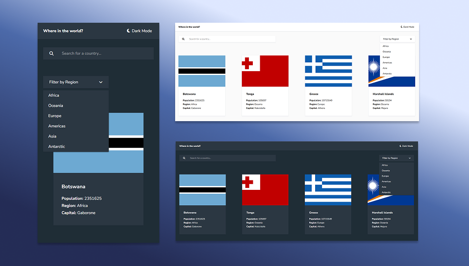

# Frontend Mentor - REST Countries API with color theme switcher solution

This is a solution to the [REST Countries API with color theme switcher challenge on Frontend Mentor](https://www.frontendmentor.io/challenges/rest-countries-api-with-color-theme-switcher-5cacc469fec04111f7b848ca). Frontend Mentor challenges help you improve your coding skills by building realistic projects. 

## Table of contents
- [Frontend Mentor - REST Countries API with color theme switcher solution](#frontend-mentor---rest-countries-api-with-color-theme-switcher-solution)
  - [Table of contents](#table-of-contents)
  - [Overview](#overview)
    - [The challenge](#the-challenge)
    - [Screenshot](#screenshot)
    - [Links](#links)
  - [My process](#my-process)
    - [Built with](#built-with)
    - [What I learned](#what-i-learned)
    - [Continued development](#continued-development)
  - [Author](#author)

## Overview

### The challenge

Users should be able to:

- See all countries from the API on the homepage
- Search for a country using an `input` field
- Filter countries by region
- Click on a country to see more detailed information on a separate page
- Click through to the border countries on the detail page
- Toggle the color scheme between light and dark mode *(optional)*

### Screenshot

### Links

- [Solution](https://github.com/jobearry/studies/tree/main/Frontend%20Mentor/REST%20Countries)
- [Live Site](https://fem-countries.vercel.app/)

## My process

### Built with

- Semantic HTML5 markup
- Mobile-first workflow
- [React](https://reactjs.org/)
- [React Router](https://reactrouter.com/)
- [TailwindCSS](https://tailwindcss.com/)
  
### What I learned

I learned how to use React Router on this project, and it feels different from my experience in Angular Router at first, but eventually understood that its still similar.

I really find React more complex than Angular, but using useState and useEffect, is somewhat better than using Input, Output on Angular, or even NgRx, or maybe I just suck at React 😅

### Continued development

I want to improve my use of React Hooks, and how to structure it properly, along with better structure on using React Router. Any tips are highly appreciated!🙇‍♂️

## Author

- [GitHub](https://github.com/jobearry)
- [Portfolio](https://jobry.online)
- [Youtube](https://www.youtube.com/@dev.jobryy)
- [Frontend Mentor](https://www.frontendmentor.io/profile/jobearry)