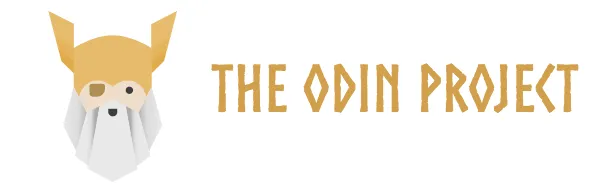
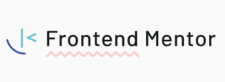

# Joby's Study

Welcome to my study, where my programming activities, challenges lies through the course of my developer journey. 

I made different branches for each category/project:
- [The Odin Project](https://github.com/jobearry/studies/tree/the-odin-project)
  
    
  
- [Front-end Mentor](https://github.com/jobearry/studies/tree/front-end-mentor)
  
    

- [Activities inspired from tutorials](https://github.com/jobearry/studies/tree/inspired-from-tutorials)
  
    
