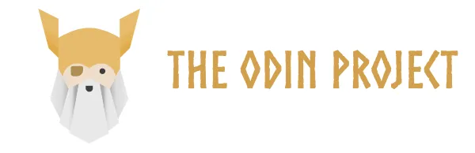
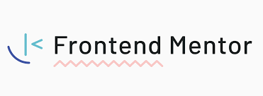

# Joby's Study
    

Welcome to my study, where my programming activities, challenges lies through the course of my developer journey. 

**Learning Materials**
-

I made different branches for other inspos:
- [The Odin Project](https://github.com/jobearry/studies/tree/the-odin-project)
<!--   
     -->
  
- [Front-end Mentor](https://github.com/jobearry/studies/tree/front-end-mentor)
<!--   
     -->

**Learning by doing**
-
- [Activities inspired from tutorials](https://github.com/jobearry/studies/tree/inspired-from-tutorials)
  
- [Simple VB6 Calculator](./Simple%20VB6%20Calculator/)
